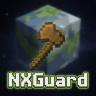

# NXGuard

**NXGuard** is a Minecraft server plugin that lets you manage your WorldGuard region flags visually, without typing commands. Everything is done from an inventory menu.

---

## What is it for?

If you use WorldGuard on your server to protect areas (spawn, shops, PvP arenas, etc.), NXGuard gives you a graphical interface to enable or disable the flags of each region with a single click, instead of typing `/rg flag <region> <flag> <value>` every time.

---

## What can you do with NXGuard?

- See all the regions of your world in a paginated menu.
- Open the flag editor of any region with one click.
- See the state of each flag at a glance thanks to colors:
  - **Lime green** → flag enabled (ALLOW)
  - **Red** → flag disabled (DENY)
  - **Gray** → no value set (NONE - uses WorldGuard's default behavior)
- Enable, disable or reset flags with left and right click.
- View the full information of a region in chat.
- Customize titles, colors and messages from `config.yml`.

---

## Requirements

| Requirement | Notes |
|---|---|
| Minecraft Paper / Spigot | Version 1.20 or higher |
| WorldGuard | Required |
| WorldGuard Extra Flags | Optional — its flags show up automatically |

---

## Guide contents

- [Installation](instalacion.md)
- [Commands](comandos.md)
- [Permissions](permisos.md)
- [Configuration](configuracion/config-yml.md)
- [GUI Usage](gui.md)
- [Flag System](flags.md)
- [FAQ](faq.md)
