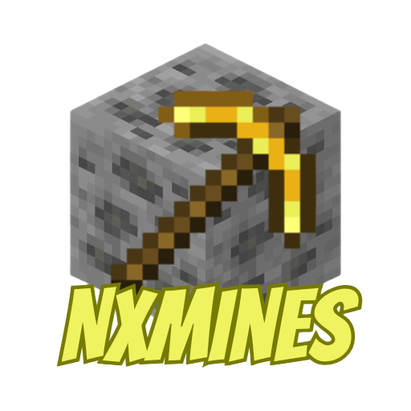

# NXMines

**NXMines** is an advanced, modular and highly configurable mines plugin for Minecraft Paper 1.20+ servers. It lets you create, manage and customize mining areas with automatic reset, customizable block composition, per-block drop tables, a full graphical interface and support for PlaceholderAPI and Vault.

---

## What is it for?

If you want mining zones on your server that regenerate automatically after some time (or when they run out), NXMines gives you everything you need: create mines using your WorldEdit or FAWE selection, configure which blocks appear (with their percentages), define which drops players get when breaking each block, and manage everything from a visual inventory menu.

---

## What can you do with NXMines?

- Create mines from your WorldEdit / FAWE selection with a single command.
- View and manage all your mines from a paginated GUI menu.
- Configure the **block composition** of each mine with precise percentages.
- Define **custom drop tables** per block: items, XP, commands and messages.
- Adjust the **reset interval** of each mine individually.
- Force manual resets from the GUI or by command.
- **Redefine the region** of an existing mine without losing its configuration.
- **Duplicate** mines to reuse composition and drops.
- **Export** a mine's configuration to an external YAML file.
- **Import mines** from CataMines and AxMines with the `/mine convert` command.
- See dynamic placeholders in real time with **PlaceholderAPI**.
- Choose between **SQLite** (default) or **MySQL / MariaDB** databases.
- Customize particles and sounds for reset and creation events.
- Multi-language support: includes messages in **Spanish** and **English**.

---

## Requirements

| Requirement | Notes |
|---|---|
| Minecraft Paper | Version 1.20 or higher |
| Java | 17 or higher |
| WorldEdit **or** FastAsyncWorldEdit | Required to create and redefine mines |
| PlaceholderAPI | Optional — enables `%nxmines_*%` placeholders |
| Vault | Optional — economy integration |
| CataMines / AxMines | Optional — only needed to import mines |

---

## Guide contents

- [Installation](instalacion.md)
- [Commands](comandos.md)
- [Permissions](permisos.md)
- [GUI Usage](gui.md)
- [Drop System](drops.md)
- [PlaceholderAPI](placeholders.md)
- [Configuration — config.yml](configuracion/config-yml.md)
- [Configuration — menus.yml](configuracion/menus-yml.md)
- [Configuration — particles.yml](configuracion/particles-yml.md)
- [Configuration — sounds.yml](configuracion/sounds-yml.md)
- [Importing Mines (Convert)](convert.md)
- [FAQ](faq.md)
