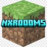
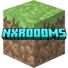

# Naxito's Studios — Official Documentation

Welcome to the official documentation of **Naxito's Studios**. Here you'll find detailed guides, installation tutorials, command lists, permissions and configuration examples for all our Minecraft plugins (Paper 1.20+).

---

## Available Plugins

<b>NXGuard — Visual WorldGuard Editor</b>

 

**NXGuard** lets you manage all your WorldGuard region flags through a fully visual GUI menu, without needing to remember or type complex commands.

- **Features:** Paginated GUI menu, WorldGuard Extra Flags support, real-time 1-click editing.
- [View full NXGuard documentation](NXGuard/README.md)

<b>NXMines — Advanced Mines System</b>

 

**NXMines** is a complete, optimized solution for creating and managing mines with automatic resets, percentage-based block composition and custom drop tables.

- **Features:** Mine creator with WorldEdit/FAWE selection, per-block drops (items, XP, commands), PAPI and Vault compatibility, importer from CataMines/AxMines.
- [View full NXMines documentation](NXMines/README.md)

<b>NXRooms — Competitive PvP Rooms</b>

 

**NXRooms** is a full PvP rooms system for 1v1, 2v2 and 3v3 arenas, with a physical wand-based room creation flow and spectator support.

- **Features:** 3-stage wand creation, automatic team assignment, inventory preservation, per-room flags and potion effects, PlaceholderAPI stats.
- [View full NXRooms documentation](NXRooms/README.md)

---

## Community & Support

Have questions, found a bug, or need help configuring the plugins? Join our official community!

- **Official Discord:** [Join the Naxito's Studios Discord](https://discord.gg/Xex24yPpWn)

---

> [!TIP]
> Select the plugin you want to configure from the left-hand sidebar to access its tutorials and command references.
